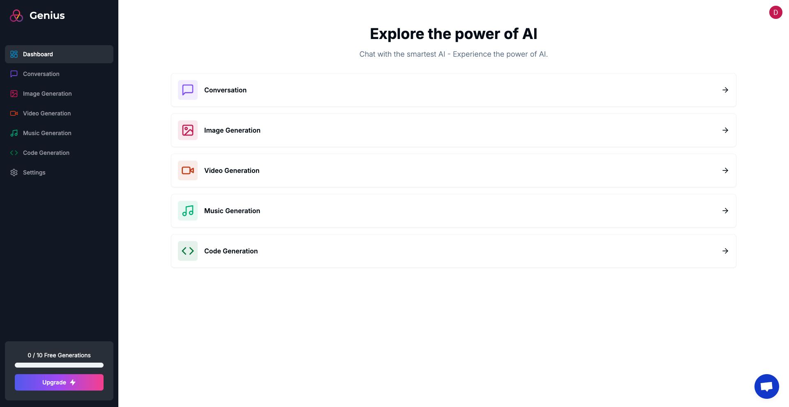
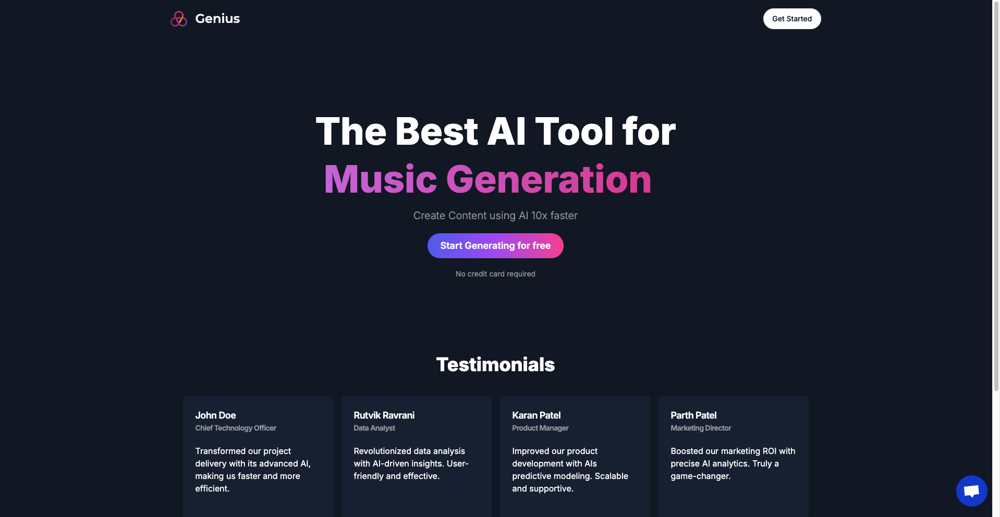

# AI SaaS Platform

### This repository contains the code for an AI SaaS Platform built using Next.js 13 with the App Router. The platform includes five AI tools and integrates Stripe for subscription management. It leverages modern web technologies to ensure a robust and scalable application.

### *Features*
* __Next.js 13 App Router__: Advanced client-side routing.

* __Stripe Subscription System__: Efficient billing process.

* __Clerk Authentication__: Secure user authentication.

* __AI Tools__: Conversation AI, Code Generation AI, Image Generation AI, Music Generation AI, Video Generation AI.

* __Dashboard__: Manage AI tools and user interactions.

* __Error Handling & Customer Support__: Integrated with Crisp.

### *Technologies Used*

* __Next.js 13__: Framework for server-rendered React applications.
* __React__: JavaScript library for building user interfaces.
* __Tailwind CSS__: Utility-first CSS framework.
* __Prisma__: Next-generation ORM for MySQL.
* __MySQL__: Relational database management system.
* __Clerk__: Authentication and user management.
* __Open AI & Replicate AI__: AI tools for various functionalities.
* __Stripe__: Online payment processing.

## Dashboard

## Landing

 [Deployment Link](https://genius-five-xi.vercel.app/)

